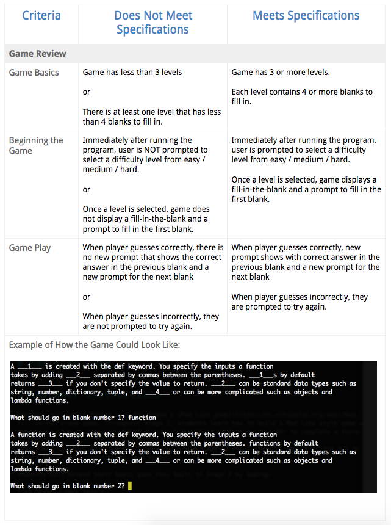

#Udacity Introduction to Programming Nanodegree: Stage Two Project

This reverce madlib game has three levels and each level has four. When the program runs, the user is prompted to select a difficulty level (easy, medium or hard). Once a level is selected, the program displays a fill-in-the-blank paragraph, and the user is prompted to take a guess.

When the user guesses corrrectly, the blank space is updated. Afterwards, the program will ask the user for input for the next blank space. If the user guesses incorrectly, he or she is prompted to try again. 

You can check out Udacity's grading rubric for this project below or an example of how this program should ideally work at this link: https://github.com/udacity/ipnd-starter-code/blob/master/stage_2/project

 