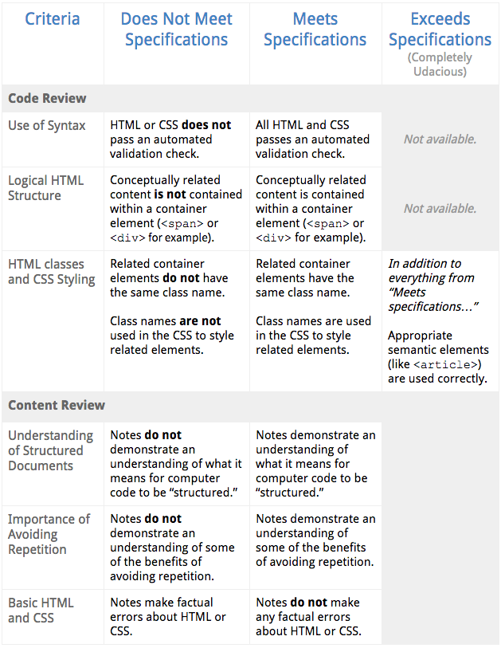

#Project Specification for the stage 1 of the Udacity Introduction to Programming Nanodegree

This is an  example submission that would meet specifications.

Here is a snapshot of the grading rubric.  